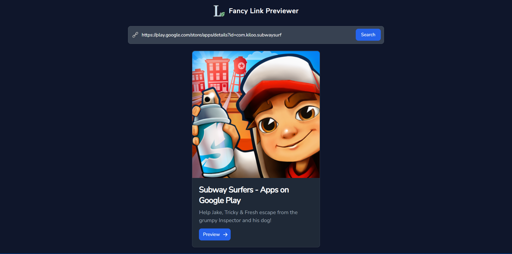

<h3 align="center"> 👉 Fancy Link Previewer </h3>

  

### 
 ⭐ Fancy Link Previewer extract metadata from a website and show overview of the website with Enrich UI. 

### 
 [😉 Visit Site](https://linkshow.samarpandasgupta.in/) 

### 
 Show 💝 by staring this repo 😚 

### 🔥 How to setup this project?

#### - Create a folder in local machine.
#### - Under that folder open terminal.
#### - git init
#### - git clone https://github.com/SamarpanCoder2002/Fancy-Link-Previewer
#### - cd link-previewer

### 👉 Start Backend Server
#### - cd backend
#### - npm install
#### - npm start

### 👉 Start Frontend
#### - cd frontend
#### - make `.env` file.
#### - under `.env` file write this
`REACT_APP_HOST_URL=http://localhost:8000/api`
#### - npm install
#### - npm start